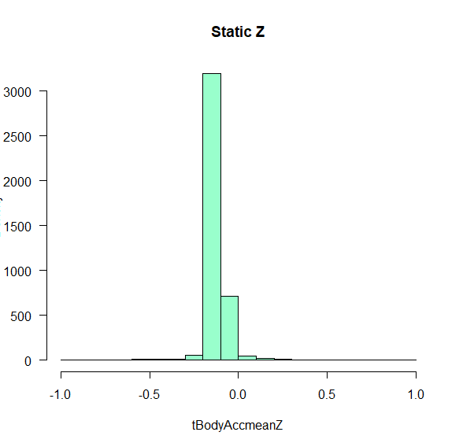

# Human-Activity-Recognition
This project involves Human Activity Recognition and Tracking through Samsung Galaxy Gear S2 data. I had been given 6 features from the
tracker, and had to use them to classify the data into six types of activities by unsupervised machine learning methods.

5 Some Initial Data Exploration
We first study the distribution of the (time-averaged) values of the triaxial accelerometer and gyroscope. We will look at the
distribution of these data.
Assignment [15 + 15]
1. Compute the density plot (histogram) of the X, Y and Z coordinates of the mean body acceleration when the subject is lying on a
horizontal position (condition incorrectly called LAYING) (see Fig. 1).
You will notice that while the subject is resting in a horizontal position, the X and Z components of the acceleration are not zero
(See Fig. 1). This is because the triaxial accelerometer is measuring any deviation of the sensor created by a force. In the presence of
gravity, the accelerometer is measuring the earth gravity. The component affected by gravity are related to the orientation of the
smartphone with respect to the direction of the gravitational force.
     
      

Figure 1.a : Density plot of the linear acceleration while lying down. Each column corresponds to one coordinate (X,Y, and Z from left to right).

     

Figure 1.b : Density plot of the linear acceleration while walking up. Each column corresponds to one coordinate (X,Y, and Z from left to
right).

2. Repeat the previous question using the three gyroscope measurements (X,Y and Z) (see Fig. 2). Again, you will notice that none of the
components of the angular velocity are exactly zero while the subject is resting in a horizontal position (see Fig. 2). This small offset
of the resting position shall not affect the classification.

     

Figure 2.a : Density plot of angular velocity lying down. Each column corresponds to one coordinate (X,Y, and Z from left to right).

     

Figure 2.b : Density plot of angular velocity walking upstairs. Each column corresponds to one coordinate (X,Y, and Z from left to
right).

5.1 The Coupling between the Sensor Measurements: The Linear Part
We propose to compute the amount of coupling between the different measurements. Since the 561 are all derived from a set of six
measurements (three components of linear acceleration and three components of angular velocity), we expect that all the measurements be
highly correlated.
Assignment [30]
3. Compute the correlation matrix for the train dataset formed by the 7352  561 matrix. Display the correlation matrix as a heatmap (see
Fig. 3). What do you conclude?

 

Figure 3: Sample correlation matrix of the 561 measurement. The correlation matrix is computed using the 7,352 rows of measurements,
across the different subjects.

6 Classification of the Activities using a Support Vector Machine
We begin our study of the recognition of human activity with a support vector machine. We confirmed that many of the 561 variables are
correlated, and therefore the dataset may not be linearly separable. We propose to use a Gaussian radial kernel, and introduce a
regularization term, , that scales the penalization of the slack terms. You will optimize  using the validation (test) set.
Assignment [90 = 40 + 40 + 10]
Train a support vector machine (SVM) classifier using the training data. You will use a Gaussian kernel.
You will use the test (validation) data to optimize the regularization parameter, , via cross-validation.
4. Plot the classification error as a function of , and return the optimal value   associated with the minimum classification error.

 

Figure 4: Lambda vs Residual Sum of Squares.

5. Apply the SVM classifier on the test data, and compute the confusion matrix to report the number of activities in class i that were
classified as class j (see Table 1.) You will use the optimal regularization parameter,  .

accuracy
[1] 96.337

Confuse=kable(confusionMatrix(data = test.c_2, reference = predict_class_2)$table)

|   1	|   2	|   3	|   4	|   5	|   6|
|---:	|---:	|---:	|---:	|---:	|---:|
| 478	|  12	|   6	|   0	|   0	|   0|
|   0	| 393	|  14	|   0	|   0	|   0|
|   0	|   5	| 427	|   0	|   0	|   0|
|   0	|   0	|   0	| 413	|  10	|   0|
|   0	|   0	|   0	|  14	| 316	|   1|
|   0	|   0	|   0	|   0	|  27	| 340|

Table 1: Confusion matrix using a kernel-SVM with    10.

6. Discuss the pattern of misclassification: are the dynamic activities misclassified as static activities?
What are the activities that are the easiest to classify? the hardest to classify? You will explain your findings.

Following are the misclassification rates for static vs non static:
mis_static
[1] 0.02771536

mis_non_static
[1] 0.04638715

This shows that misclassification rates is higher in non static activities.

Following are the misclassification rates for different activities:

mis_laying
[1] 0

mis_sitting
[1] 0.04146341

mis_standing
[1] 0.04474273

mis_walking
[1] 0.03278689

mis_walking_down
[1] 0.1048159

mis_walking_up
[1] 0.002932551

This shows that misclassification rate is the lowest for laying and the highest for walking down.

6.1 The Geometry of the Different Activities Combined
We explore the question of linear separability in this section. We propose to visualize the accelerometer dataset, 􀀀! a ¹tº during all
the activities. We color-code each point according to the activity (see Figs. 4 and 5). The scatterplot illustrates the fact that the
different activities form intricate patterns that do not appear to be linearly separable.

Assignment [100 = 20+10+20+10]
7. Use the three coordinates (X,Y,Z) provided by the body linear acceleration 􀀀! a T ¹tº   
tBodyAcc-mean-X
tBodyAcc-mean-Y
tBodyAcc-mean-Z
(3)
to display a three-dimensional scatterplot of the training data (see Fig. 4). In R, you can use the
package scatterplot3d. In python, you can use the mpl_toolkit mplot3d from matplotlib.

 

Figure 5.a : N   7, 352 observations of the vector of linear body acceleration 􀀀! a ¹tº. The color of the point encodes the activity
performed at the time when the measurement was taken.

 

Figure 5.b : N   7, 352 observations of the vector of linear body acceleration 􀀀! a ¹tº. The color of the point encodes the activity
performed at the time when the measurement was taken.

 

Figure 5.c : N   7, 352 observations of the vector of linear body acceleration 􀀀! a ¹tº. The color of the point encodes the activity
performed at the time when the measurement was taken.

8. Can you visually distinguish some activities (e.g., sitting)? Justify your answer, based on the type of activity:
static (SITTING, STANDING,LAYING) vs dynamic (WALKING,WALKING_UPSTAIRS,
WALKING_DOWNSTAIRS).

From the above plots, no. The reasons are explained below:

     

Figure 6.a : Density plot of the linear acceleration for static activities. Each column corresponds to one coordinate (X,Y, and Z from
left to right).

     

Figure 6.b : Density plot of the linear acceleration for non static activities. Each column corresponds to one coordinate (X,Y, and Z
from left to right).

Key thing to note is that means for all activities are almost same.

Which leads us to further statistical investigation:

summary.all.variables(acc_t_static[1:3])
|       dv.name |   n    |      mean     |        	var |		g3.skewness |    g4.kurtosis |
|---:	      |---:	|---:	      |---:	         |---:	                 |---:            |
| tBodyAccmeanX |	4067 |  0.27395052   |	0.004276742   | -7.5917236           |	120.8661      |
| tBodyAccmeanY |	4067 |  -0.01563321  |	0.002314875   | -0.4131948           |	160.7371      |
| tBodyAccmeanZ |	4067 |   -0.10703716 |	0.003864128   |  2.6359910           |	105.4638      |

summary.all.variables(acc_t_non_static[1:3])
|       dv.name |   n    |      mean     |        	var |		g3.skewness |    g4.kurtosis |
|---:	      |---:	|---:	      |---:	         |---:	                 |---:            |
| tBodyAccmeanX |	3285 |  0.27515370   |	0.0057544114  | -0.1190463           |	0.9943328     |
| tBodyAccmeanY |	3285 |  -0.02024856  |	0.0008502104  | -0.6280562           |	2.7974929     |
| tBodyAccmeanZ |	3285 |   -0.11174571 |	0.0023833210  |  -0. 5994068         |	3.6330838     |

The variances look similar too. The only statistical measure which can successfully separate static from non static seems to be Kurtosis.

Use the three coordinates (X,Y,Z) provided by the body angular velocity 􀀀! ! ¹tº  
tBodyGyro-mean-X
tBodyGyro-mean-Y
tBodyGyro-mean-Z
(4)
to display a three-dimensional scatterplot of the training data (see Fig. 5).

 

Figure 7.a : N   7, 352 observations of the vector of linear body angular velocity 􀀀! a ¹tº. The color of the point encodes the activity
performed at the time when the measurement was taken.

 

Figure 7.b : N   7, 352 observations of the vector of linear body angular velocity 􀀀! a ¹tº. The color of the point encodes the activity
performed at the time when the measurement was taken.

 

Figure 7.c : N   7, 352 observations of the vector of linear body angular velocity 􀀀! a ¹tº. The color of the point encodes the activity
performed at the time when the measurement was taken.

10. Can you visually distinguish some activities? What are the coordinates of the sitting activities?

From the above plots, no. The reasons are explained below:

     
     

Figure 8.a : Density plot of angular velocity sitting. Each column corresponds to one coordinate (X,Y, and Z from left to right).

summary.all.variables(gyro_t_sitting[1:3])
|       dv.name |   n    |      mean     |        	var |		g3.skewness |    g4.kurtosis |
|---:	      |---:	|---:	      |---:	         |---:	                 |---:            |
| tBodyAccmeanX |	1286 |  0.03783059   |	0.001974668   | -3.350336            |	17.26936      |
| tBodyAccmeanY |	1286 |  -0.07280278  |	0.008921608   | -3.241138            |	27.62308      |
| tBodyAccmeanZ |	1286 |   -0.07847421 |	0.016648599   |  -2.600225           |	13.14961      |

     

Figure 8.b : Density plot of angular velocity lying down. Each column corresponds to one coordinate (X,Y, and Z from left to right).

summary.all.variables(gyro_t_laying[1:3])
|       dv.name |   n    |      mean    |        	var    |		g3.skewness |    g4.kurtosis |
|---:	      |---:	|---:	     |---:	       |---:	            |---:            |
| tBodyAccmeanX |	1407 |  -0.01676119 |	0.003655170 | 1.840969          |	16.38695      |
| tBodyAccmeanY |	1407 |  -0.09166082 |	0.007879606 | -2.979016         |	15.90234      |
| tBodyAccmeanZ |	1407 |   0.12714792 |	0.020343363 |  2.843176         |	10.67111      |

      

Figure 8.c : Density plot of angular velocity standing. Each column corresponds to one coordinate (X,Y, and Z from left to right).

summary.all.variables(gyro_t_standing[1:3])
|        dv.name |   n   |      mean     |        	var |		g3.skewness |    g4.kurtosis |
|---:	       |---:	|---:	      |---:	         |---:	                 |---:            |
| tBodyAccmeanX  |	1374 |  -0.02632320  |	0.0006619619  | 1.940342             |	36.95479      |
| tBodyAccmeanY  |	1374 |  -0.06607461  |	0.0033506525  | 3.984828             |	24.78807      |
| tBodyAccmeanZ  |	1374 |   -0.07877825 |	0.0022843271  |  -3.781508           |	23.15011      |

     
     

Figure 8.d : Density plot of angular velocity walking. Each column corresponds to one coordinate (X,Y, and Z from left to right).

summary.all.variables(gyro_t_walking[1:3])
|       dv.name |  n     |      mean    |        	var         |		g3.skewness |    g4.kurtosis  |
|---:	      |---:	|---:	     |---:	            |---:	            |---:             |
| tBodyAccmeanX |	1226 |  -0.03125331 |	     0.016429981 |   -0.9132899      |	     8.040476  |
| tBodyAccmeanY |	1226 |  -07131259   |	     0.008383257 |   1.1579990       |	     5.256484  |
| tBodyAccmeanZ |	1226 |   0.08419440 |	     0.005662242 |   -1.0712582      |	     11.767728 |

              

Figure 8.e : Density plot of angular velocity walking upstairs. Each column corresponds to one coordinate (X,Y, and Z from left to right).

summary.all.variables(gyro_t_walking_down[1:3])

|      dv.name  |  n    |     mean     |   	var 	  |	g3.skewness|    g4.kurtosis  |
|---:	      |---:   |---:	         |---:	       |---:	      |---:             |
| tBodyAccmeanX |	986 | -0.0766236   | 0.10519933 |   0.1428550 |	   -0.8198465 |
| tBodyAccmeanY |	986 |  -0.05590992 | 0.03515019 |   0.1311227 |	   0.3481811  |
| tBodyAccmeanZ |	986 |   0.09392529 |0.02498519  |   0.1289896 |	   3.2828298  |

         

Figure 8.f : Density plot of angular velocity walking upstairs. Each column corresponds to one coordinate (X,Y, and Z from left to right).

summary.all.variables(acc_t_non_static[1:3])

|       dv.name |   n    |      mean     |        var     |	g3.skewness  |g4.kurtosis |
|---:	      |---:	|---:	      |---:	        |---:	        |---:        |
| tBodyAccmeanX |	3285 |  0.27515370   |	0.0057544114 | -0.1190463   |	0.9943328  |
| tBodyAccmeanY |	3285 |  -0.02024856  |	0.0008502104 | -0.6280562   |	2.7974929  |
| tBodyAccmeanZ |	3285 |   -0.11174571 |	0.0023833210 |  -0. 5994068 |	3.6330838  |
