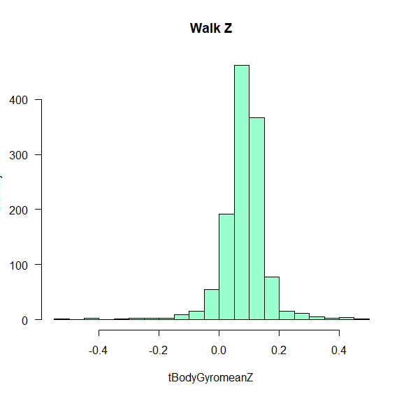

# Human-Activity-Recognition
This project involves Human Activity Recognition and Tracking through Samsung Galaxy Gear S2 data. I had been given 6 features from the
tracker, and had to use them to classify the data into six types of activities by unsupervised machine learning methods.

5 Some Initial Data Exploration
We first study the distribution of the (time-averaged) values of the triaxial accelerometer and gyroscope. We will look at the
distribution of these data.
Assignment [15 + 15]
1. Compute the density plot (histogram) of the X, Y and Z coordinates of the mean body acceleration when the subject is lying on a
horizontal position (condition incorrectly called LAYING) (see Fig. 1).
You will notice that while the subject is resting in a horizontal position, the X and Z components of the acceleration are not zero
(See Fig. 1). This is because the triaxial accelerometer is measuring any deviation of the sensor created by a force. In the presence of
gravity, the accelerometer is measuring the earth gravity. The component affected by gravity are related to the orientation of the
smartphone with respect to the direction of the gravitational force.
     
       

Figure 1.a : Density plot of the linear acceleration while lying down. Each column corresponds to one coordinate (X,Y, and Z from left to right).

     
       

Figure 1.b : Density plot of the linear acceleration while walking up. Each column corresponds to one coordinate (X,Y, and Z from left to right).

2. Repeat the previous question using the three gyroscope measurements (X,Y and Z) (see Fig. 2). Again, you will notice that none of the
components of the angular velocity are exactly zero while the subject is resting in a horizontal position (see Fig. 2). This small offset
of the resting position shall not affect the classification.

     
       

Figure 2.a : Density plot of angular velocity lying down. Each column corresponds to one coordinate (X,Y, and Z from left to right).

     
       

Figure 2.b : Density plot of angular velocity walking upstairs. Each column corresponds to one coordinate (X,Y, and Z from left to
right).

5.1 The Coupling between the Sensor Measurements: The Linear Part
We propose to compute the amount of coupling between the different measurements. Since the 561 are all derived from a set of six
measurements (three components of linear acceleration and three components of angular velocity), we expect that all the measurements be
highly correlated.
Assignment [30]
3. Compute the correlation matrix for the train dataset formed by the 7352  561 matrix. Display the correlation matrix as a heatmap (see
Fig. 3). What do you conclude?

 

Figure 3: Sample correlation matrix of the 561 measurement. The correlation matrix is computed using the 7,352 rows of measurements,
across the different subjects.

6 Classification of the Activities using a Support Vector Machine
We begin our study of the recognition of human activity with a support vector machine. We confirmed that many of the 561 variables are
correlated, and therefore the dataset may not be linearly separable. We propose to use a Gaussian radial kernel, and introduce a
regularization term, , that scales the penalization of the slack terms. You will optimize  using the validation (test) set.
Assignment [90 = 40 + 40 + 10]
Train a support vector machine (SVM) classifier using the training data. You will use a Gaussian kernel.
You will use the test (validation) data to optimize the regularization parameter, , via cross-validation.
4. Plot the classification error as a function of , and return the optimal value   associated with the minimum classification error.

 

Figure 4: Lambda vs Residual Sum of Squares.

5. Apply the SVM classifier on the test data, and compute the confusion matrix to report the number of activities in class i that were
classified as class j (see Table 1.) You will use the optimal regularization parameter,  .

accuracy
[1] 96.337

Confuse=kable(confusionMatrix(data = test.c_2, reference = predict_class_2)$table)

|   1	|   2	|   3	|   4	|   5	|   6|
|---:	|---:	|---:	|---:	|---:	|---:|
| 478	|  12	|   6	|   0	|   0	|   0|
|   0	| 393	|  14	|   0	|   0	|   0|
|   0	|   5	| 427	|   0	|   0	|   0|
|   0	|   0	|   0	| 413	|  10	|   0|
|   0	|   0	|   0	|  14	| 316	|   1|
|   0	|   0	|   0	|   0	|  27	| 340|

Table 1: Confusion matrix using a kernel-SVM with    10.

6. Discuss the pattern of misclassification: are the dynamic activities misclassified as static activities?
What are the activities that are the easiest to classify? the hardest to classify? You will explain your findings.

Following are the misclassification rates for static vs non static:
mis_static
[1] 0.02771536

mis_non_static
[1] 0.04638715

This shows that misclassification rates is higher in non static activities.

Following are the misclassification rates for different activities:

mis_laying
[1] 0

mis_sitting
[1] 0.04146341

mis_standing
[1] 0.04474273

mis_walking
[1] 0.03278689

mis_walking_down
[1] 0.1048159

mis_walking_up
[1] 0.002932551

This shows that misclassification rate is the lowest for laying and the highest for walking down.

6.1 The Geometry of the Different Activities Combined
We explore the question of linear separability in this section. We propose to visualize the accelerometer dataset, 􀀀! a ¹tº during all
the activities. We color-code each point according to the activity (see Figs. 4 and 5). The scatterplot illustrates the fact that the
different activities form intricate patterns that do not appear to be linearly separable.

Assignment [100 = 20+10+20+10]
7. Use the three coordinates (X,Y,Z) provided by the body linear acceleration 􀀀! a T ¹tº   
tBodyAcc-mean-X
tBodyAcc-mean-Y
tBodyAcc-mean-Z
(3)
to display a three-dimensional scatterplot of the training data (see Fig. 4). In R, you can use the
package scatterplot3d. In python, you can use the mpl_toolkit mplot3d from matplotlib.

 

Figure 5.a : N   7, 352 observations of the vector of linear body acceleration 􀀀! a ¹tº. The color of the point encodes the activity
performed at the time when the measurement was taken.

 

Figure 5.b : N   7, 352 observations of the vector of linear body acceleration 􀀀! a ¹tº. The color of the point encodes the activity
performed at the time when the measurement was taken.

 

Figure 5.c : N   7, 352 observations of the vector of linear body acceleration 􀀀! a ¹tº. The color of the point encodes the activity
performed at the time when the measurement was taken.

8. Can you visually distinguish some activities (e.g., sitting)? Justify your answer, based on the type of activity:
static (SITTING, STANDING,LAYING) vs dynamic (WALKING,WALKING_UPSTAIRS,
WALKING_DOWNSTAIRS).

From the above plots, no. The reasons are explained below:

     
       

Figure 6.a : Density plot of the linear acceleration for static activities. Each column corresponds to one coordinate (X,Y, and Z from
left to right).

     
       

Figure 6.b : Density plot of the linear acceleration for non static activities. Each column corresponds to one coordinate (X,Y, and Z
from left to right).

Key thing to note is that means for all activities are almost same.

Which leads us to further statistical investigation:

summary.all.variables(acc_t_static[1:3])
|       dv.name |   n    |      mean     |        	var |		g3.skewness |    g4.kurtosis |
|---:	      |---:	|---:	      |---:	         |---:	                 |---:            |
| tBodyAccmeanX |	4067 |  0.27395052   |	0.004276742   | -7.5917236           |	120.8661      |
| tBodyAccmeanY |	4067 |  -0.01563321  |	0.002314875   | -0.4131948           |	160.7371      |
| tBodyAccmeanZ |	4067 |   -0.10703716 |	0.003864128   |  2.6359910           |	105.4638      |

summary.all.variables(acc_t_non_static[1:3])
|       dv.name |   n    |      mean     |        	var |		g3.skewness |    g4.kurtosis |
|---:	      |---:	|---:	      |---:	         |---:	                 |---:            |
| tBodyAccmeanX |	3285 |  0.27515370   |	0.0057544114  | -0.1190463           |	0.9943328     |
| tBodyAccmeanY |	3285 |  -0.02024856  |	0.0008502104  | -0.6280562           |	2.7974929     |
| tBodyAccmeanZ |	3285 |   -0.11174571 |	0.0023833210  |  -0. 5994068         |	3.6330838     |

The variances look similar too. The only statistical measure which can successfully separate static from non static seems to be Kurtosis.

Use the three coordinates (X,Y,Z) provided by the body angular velocity 􀀀! ! ¹tº  
tBodyGyro-mean-X
tBodyGyro-mean-Y
tBodyGyro-mean-Z
(4)
to display a three-dimensional scatterplot of the training data (see Fig. 5).

 

Figure 7.a : N   7, 352 observations of the vector of linear body angular velocity 􀀀! a ¹tº. The color of the point encodes the activity
performed at the time when the measurement was taken.

 

Figure 7.b : N   7, 352 observations of the vector of linear body angular velocity 􀀀! a ¹tº. The color of the point encodes the activity
performed at the time when the measurement was taken.

 

Figure 7.c : N   7, 352 observations of the vector of linear body angular velocity 􀀀! a ¹tº. The color of the point encodes the activity
performed at the time when the measurement was taken.

10. Can you visually distinguish some activities? What are the coordinates of the sitting activities?

From the above plots, no. The reasons are explained below:

     
       

Figure 8.a : Density plot of angular velocity sitting. Each column corresponds to one coordinate (X,Y, and Z from left to right).

summary.all.variables(gyro_t_sitting[1:3])
|       dv.name |   n    |      mean     |        	var |		g3.skewness |    g4.kurtosis |
|---:	      |---:	|---:	      |---:	         |---:	                 |---:            |
| tBodyAccmeanX |	1286 |  0.03783059   |	0.001974668   | -3.350336            |	17.26936      |
| tBodyAccmeanY |	1286 |  -0.07280278  |	0.008921608   | -3.241138            |	27.62308      |
| tBodyAccmeanZ |	1286 |   -0.07847421 |	0.016648599   |  -2.600225           |	13.14961      |

       

Figure 8.b : Density plot of angular velocity lying down. Each column corresponds to one coordinate (X,Y, and Z from left to right).

summary.all.variables(gyro_t_laying[1:3])
|       dv.name |   n    |      mean    |        	var    |		g3.skewness |    g4.kurtosis |
|---:	      |---:	|---:	     |---:	       |---:	            |---:            |
| tBodyAccmeanX |	1407 |  -0.01676119 |	0.003655170 | 1.840969          |	16.38695      |
| tBodyAccmeanY |	1407 |  -0.09166082 |	0.007879606 | -2.979016         |	15.90234      |
| tBodyAccmeanZ |	1407 |   0.12714792 |	0.020343363 |  2.843176         |	10.67111      |

      
       

Figure 8.c : Density plot of angular velocity standing. Each column corresponds to one coordinate (X,Y, and Z from left to right).

summary.all.variables(gyro_t_standing[1:3])
|        dv.name |   n   |      mean     |        	var |		g3.skewness |    g4.kurtosis |
|---:	       |---:	|---:	      |---:	         |---:	                 |---:            |
| tBodyAccmeanX  |	1374 |  -0.02632320  |	0.0006619619  | 1.940342             |	36.95479      |
| tBodyAccmeanY  |	1374 |  -0.06607461  |	0.0033506525  | 3.984828             |	24.78807      |
| tBodyAccmeanZ  |	1374 |   -0.07877825 |	0.0022843271  |  -3.781508           |	23.15011      |

     
       

Figure 8.d : Density plot of angular velocity walking. Each column corresponds to one coordinate (X,Y, and Z from left to right).

summary.all.variables(gyro_t_walking[1:3])
|       dv.name |  n     |      mean    |        	var         |		g3.skewness |    g4.kurtosis  |
|---:	      |---:	|---:	     |---:	            |---:	            |---:             |
| tBodyAccmeanX |	1226 |  -0.03125331 |	     0.016429981 |   -0.9132899      |	     8.040476  |
| tBodyAccmeanY |	1226 |  -07131259   |	     0.008383257 |   1.1579990       |	     5.256484  |
| tBodyAccmeanZ |	1226 |   0.08419440 |	     0.005662242 |   -1.0712582      |	     11.767728 |

              
       

Figure 8.e : Density plot of angular velocity walking upstairs. Each column corresponds to one coordinate (X,Y, and Z from left to right).

summary.all.variables(gyro_t_walking_down[1:3])

|      dv.name  |  n    |     mean     |   	var 	  |	g3.skewness|    g4.kurtosis  |
|---:	      |---:   |---:	         |---:	       |---:	      |---:             |
| tBodyAccmeanX |	986 | -0.0766236   | 0.10519933 |   0.1428550 |	   -0.8198465 |
| tBodyAccmeanY |	986 |  -0.05590992 | 0.03515019 |   0.1311227 |	   0.3481811  |
| tBodyAccmeanZ |	986 |   0.09392529 |0.02498519  |   0.1289896 |	   3.2828298  |

         
       

Figure 8.f : Density plot of angular velocity walking upstairs. Each column corresponds to one coordinate (X,Y, and Z from left to right).

summary.all.variables(acc_t_non_static[1:3])

|       dv.name |   n    |      mean     |        var     |	g3.skewness  |g4.kurtosis |
|---:	      |---:	|---:	      |---:	        |---:	        |---:        |
| tBodyAccmeanX |	3285 |  0.27515370   |	0.0057544114 | -0.1190463   |	0.9943328  |
| tBodyAccmeanY |	3285 |  -0.02024856  |	0.0008502104 | -0.6280562   |	2.7974929  |
| tBodyAccmeanZ |	3285 |   -0.11174571 |	0.0023833210 |  -0. 5994068 |	3.6330838  |

7 Dimension Reduction
In order to apply other classifiers, we need to drastically reduce the dimensionality of the dataset and replace the 561 highly correlated variables with a small (less than 100) set of uncorrelated variables. We propose to study the intrinsic complexity of the subset of the dataset associated with a specific activity. We expect that the dimensionality be small.
7.1 How Many Degrees of Freedom Does the Dataset Have
In the previous question, we confirmed that the 561 measurements are highly correlated since they depend only on six independent variables.
Assignment [80=20+20+20+20]
Construct the 1407561 matrixAformed by extracting from Xtrain the rows of 561 features  corresponding for all times t during which a subject is in the activity WALKING_UPSTAIRS. There should 1,407 such time instants t in the training set Xtrain.
10. Compute the principal component analysis of the matrix A. You will center and sphere the data. Plot the percentage of the residual variance as a function of the number of components (see Fig. 9.a).

 

Figure 9.a: Percentage of the residual variance explained by the first principal components during the activity WALKING_UPSTAIRS.

11. Display the points in the matrix A in the basis formed by the eigenvectors (see Fig. 10.a).

 

Figure 10.a: Projections on the first three components of the vector of 561 observations associated with the activity WALKING_UPSTAIRS.

12. Repeat the two previous questions for the activity: LAYING. You should find 1,073 events during
which the subjects are lying horizontally (see Fig. 9.b and Fig. 10.b).

 

Figure 9.b: Percentage of the residual variance explained by the first principal components during the activity LAYING.

 

Figure 10.b: Projections on the first three components of the vector of 561 observations associated with the activity LAYING.

7.2 The State Space Formed by the Body Measurements
We now revisit the question of understanding the geometry of the point cloud formed by the training data stacked in the matrix Xtrain.
Assignment [50 = 20 + 10 + 20]
Perform the principal component analysis of the matrix Xtrain. You will center and sphere the data.
13. Plot the percentage of the residual variance as a function of the number of components (see Fig. 3).

 

Figure 3: The percentage of the residual variance as a function of the number of components for the points in Xtrain.

14. Find the lowest number of components that can explain 90% of the variance in the data. You will
save this set of vectors, as you will project the test data onto them.

The lowest number of components that can explain 90% of the variance in the data is 75.

15. Display the points in the matrix Xtrain in the basis formed by the eigenvectors (see Fig. 4.a). The points need to be color-coded by activity. Compare the scatter plots in Fig. 4.a, Fig.4.b, and Fig. 4.c, and comment.

 

Figure 4.a: The points in the matrix Xtrain in the basis formed by the eigenvectors.

 

Figure 4.b: N = 7, 352 observations of Xtrain plotted with vectors of linear body acceleration 􀀀! a ¹tº.

 

Figure 4.c: N = 7, 352 observations of Xtrain plotted with vectors of angular velocity 􀀀! g ¹tº.

The scatterplot after PCA (Figure 4.a) differs in two aspects (with respect to Figure 4.b and Figure 4.c):
1. the data corresponding to each group is clustered better within the cluster. Due to this differentiating between clusters is easier.
2. Different clusters have different mean values, so that most of them do not overlap.

8 Classification using the Reduced Coordinates
8.1 Introduction
We have seen that the 561 feature vectors are highly correlated. We propose therefore to compute a set of k reduced coordinates provided by the projection of the (training and validation) dataset on the principal components computed from the training data.
8.2 Classification of the Activities using Logistic Regression
We have studied logistic regression as a method to learn the coupling between a probability and a linear
function of the data. The method can be directly applied to binary classification, where one estimates the
probability of being in one class.
Assignment [ 70 = 4 15 + 10]
16. Using the following three values of k   30, 40, 50, 60, train a logistic regression classifier using the
projection of the training data on the first k principal components. Apply the classifier on the test data, and compute the confusion matrix to report the number of activities in class i that were classified as class j (see Table 2.)

k_1 = 30
> accuracy_1
[1] 89.10757
> Confuse_1

|   1        |   2        |   3        |   4        |   5        |   6|
|---:        |---:        |---:        |---:        |---:        |---:|
| 519        |  18        |   0        |   0        |   0        |   0|
|   3        | 407        |  80        |   0        |   0        |   1|
|   0        |  51        | 481        |   0        |   0        |   0|
|   0        |   0        |   0        | 463        |  15        |  18|
|   0        |   0        |   0        |  20        | 346        |  54|
|   0        |   1        |   0        |  34        |  26        | 410|

Table 2.a: Confusion matrix using logistic regression on the first k   30 principal components.

k_2 = 40
> accuracy_2
[1] 90.22735
> Confuse_2

|   1        |   2        |   3        |   4        |   5        |   6|
|---:        |---:        |---:        |---:        |---:        |---:|
| 528        |  9         |   0        |   0        |   0        |   0|
|   0        | 412        |  78        |   0        |   0        |   1|
|   0        |  59        | 473        |   0        |   0        |   0|
|   0        |   0        |   0        | 467        |  16        |  12|
|   0        |   0        |   0        |  16        | 360        |  43|
|   0        |   0        |   0        |  48        |  4         | 419|

Table 2.b: Confusion matrix using logistic regression on the first k  = 40 principal components.

k_3 = 50
> accuracy_3
[1] 91.3132
> Confuse_3

|   1        |   2        |   3        |   4        |   5        |   6|
|---:        |---:        |---:        |---:        |---:        |---:|
| 532        |  5         |   0        |   0        |   0        |   0|
|   1        | 421        |  68        |   0        |   0        |   1|
|   0        |  54        | 478        |   0        |   0        |   0|
|   1        |   0        |   1        | 471        |  8         |  15|
|   0        |   0        |   2        |  11        | 372        |  35|
|   0        |   0        |   0        |  38        |  16        | 417|

Table 2.c: Confusion matrix using logistic regression on the first k  = 50 principal components.

k_4 = 60
> accuracy_4
[1] 91.5168
> Confuse_4

|   1        |   2        |   3        |   4        |   5        |   6|
|---:        |---:        |---:        |---:        |---:        |---:|
| 530        |  7         |   0        |   0        |   0        |   0|
|   2        | 424        |  64        |   0        |   0        |   1|
|   0        |  52        | 478        |   0        |   0        |   0|
|   0        |   0        |   0        | 471        |  10        |  15|
|   0        |   0        |   1        |  8         | 382        |  29|
|   0        |   0        |   0        |  37        |  22        | 412|

Table 2.d: Confusion matrix using logistic regression on the first k  = 60 principal components.

k_5 = 70
> accuracy_5
[1] 92.56871
> Confuse_5

|   1        |   2        |   3        |   4        |   5        |   6|
|---:        |---:        |---:        |---:        |---:        |---:|
| 532        |  5         |   0        |   0        |   0        |   0|
|   1        | 430        |  58        |   0        |   0        |   2|
|   0        |  43        | 487        |   2        |   0        |   0|
|   0        |   0        |   0        | 483        |  6         |  7 |
|   0        |   0        |   1        |  7         | 381        |  31|
|   0        |   0        |   0        |  47        |  9         | 415|

Table 2.e: Confusion matrix using logistic regression on the first k  = 70 principal components.

k_6 = 20
> accuracy_6
[1] 87.1734
> Confuse_6

|   1        |   2        |   3         |   4        |   5        |   6|
|---:        |---:        |---:         |---:        |---:        |---:|
| 507        |  29        |   1         |   0        |   0        |   0|
|   3        | 363        |  124        |   0        |   0        |   1|
|   0        |  67        | 465         |   0        |   0        |   0|
|   0        |   0        |   0         | 471        |  13        |  12|
|   0        |   0        |   0         |  28        | 334        |  58|
|   0        |   0        |   0         |  30        |  12        | 429|

Table 2.f: Confusion matrix using logistic regression on the first k  = 20 principal components.

17. Plot the classification accuracy as a function of k.

 

Figure 11: Number of Principal Components vs accuracy for logistic regression model.

8.3 Quadratic Discriminant Analysis
We propose to classify the activities using quadratic discriminant analysis (see problem set 3, and the solution provided on Canvas).
Assignment [ 70 = 4 15 + 10]
18. Using the following three values of k   30, 40, 50, 60, train a classifier based on quadratic discriminant
analysis using the projections of the training data on the first k principal components. Apply the classifier on the test data, and compute the confusion matrix to report the number of activities in class i that were classified as class j (see Table 3.)

k_1 = 30
> accuracy_1
[1] 86.83407
> Confuse_1

|   1        |   2        |   3         |   4        |   5        |   6|
|---:        |---:        |---:         |---:        |---:        |---:|
| 511        |  26        |   0         |   0        |   0        |   0|
|   3        | 331        |  156        |   0        |   0        |   1|
|   4        |  41        | 479         |   2        |   4        |   2|
|   0        |   0        |   0         | 455        |  36        |  5 |
|   0        |   0        |   0         |  13        | 346        |  61|
|   0        |   0        |   0         |  21        |  13        | 437|

Table 3.a: Confusion matrix using quadratic discriminative analysis on the first k  = 30 principal components.

k_2 = 40
> accuracy_2
[1] 87.34306
> Confuse_2

|   1        |   2        |   3         |   4        |   5            |   6|
|---:        |---:        |---:         |---:        |---:            |---:|
| 516        |  21        |   0         |   0        |   0            |   0|
|   3        | 322        |  164        |   0        |   0            |   2|
|   2        |  33        | 490         |   1        |   1        	|   5|
|   0        |   0        |   0         | 461        |  30            |  5 |
|   0        |   0        |   0         |  7         | 345            |  68|
|   0        |   0        |   0         |  22        |  9             | 440|

Table 3.b: Confusion matrix using quadratic discriminative analysis on the first k  = 40 principal components.

k_3 = 50
> accuracy_3
[1] 88.25925
> Confuse_3

|   1        |   2        |   3         |   4        |   5        |   6|
|---:        |---:        |---:         |---:        |---:        |---:|
| 517        |  20        |   0         |   0        |   0        |   0|
|   3        | 332        |  155        |   0        |   0        |   1|
|   1        |  29        | 495         |   0        |   0        |   7|
|   0        |   0        |   0         | 452        |  36        |  8 |
|   0        |   0        |   0         |  7         | 362        |  51|
|   0        |   0        |   0         |  20        |  8         | 443|

Table 3.c: Confusion matrix using quadratic discriminative analysis on the first k  = 50 principal components.

k_4 = 60
> accuracy_4
[1] 89.37903
> Confuse_4

|   1        |   2        |   3         |   4        |   5        |   6|
|---:        |---:        |---:         |---:        |---:        |---:|
| 520        |  17        |   0         |   0        |   0        |   0|
|   5        | 338        |  145        |   0        |   0        |   3|
|   3        |  24        | 499         |   0        |   0        |   3|
|   0        |   0        |   0         | 462        |  30        |  4 |
|   0        |   0        |   0         |  8         | 376        |  36|
|   0        |   0        |   0         |  20        |  12        | 439|

Table 3.d: Confusion matrix using quadratic discriminative analysis on the first k  = 60 principal components.

k_5 = 70
> accuracy_5
[1] 90.60061
> Confuse_5

|   1        |   2        |   3         |   4        |   5            |   6|
|---:        |---:        |---:         |---:        |---:            |---:|
| 524        |  13        |   0         |   0        |   0            |   0|
|   6        | 345        |  138        |   0        |   0            |   2|
|   2        |  26        | 500         |   1        |   0            |   3|
|   0        |   0        |   0         | 469        |  22        	|  5|
|   0        |   0        |   1         |  5         | 384            |  31|
|   0        |   0        |   0         |  16        |  7             | 448|

Table 3.e: Confusion matrix using quadratic discriminative analysis on the first k  = 70 principal components.

k_6 = 20
> accuracy_6
[1] 86.32508
> Confuse_6

|   1        |   2        |   3         |   4        |   5        |   6|
|---:        |---:        |---:         |---:        |---:        |---:|
| 515        |  22        |   1         |   0        |   0        |   0|
|   5        | 312        |  172        |   0        |   0        |   2|
|   1        |  41        | 483         |   4        |   2        |   1|
|   0        |   0        |   0         | 461        |  25        |  10|
|   0        |   0        |   0         |  17        | 340        |  63|
|   0        |   1        |   0         |  29        |  9         | 433|

Table 3.f: Confusion matrix using quadratic discriminative analysis on the first k  = 20 principal components.

19. Plot the classification accuracy as a function of k.

 

Figure 12: Number of Principal Components vs accuracy for quadratic discriminative analysis model.

8.4 Feed forward Neural Networks
Finally, we propose to use a feed forward neural network with one hidden layer to classify the activities.
Assignment [ 70 = 4 15 + 10]
20. Using the following three values of k   30, 40, 50, 60, train a classifier based on a forward neural network with one hidden layer, using the projections of the training data on the first k principal components. Apply the classifier on the test data, and compute the confusion matrix to report the number of activities in class i that were classified as class j (see Table 4.)
The classification results reported in Table 4 were obtained using 10 hidden units and a regularization (weight decay) parameter    0.01. You may explore other values to get a better performance.

k_1 = 30
> accuracy_1
[1] 86.39294
> Confuse_1

|   1        |   2        |   3        |   4        |   5        |   6|
|---:        |---:        |---:        |---:        |---:        |---:|
| 515        |  16        |   6        |   0        |   0        |   0|
|   2        | 399        |  90        |   0        |   0        |   0|
|   0        |  64        | 462        |   5        |   4        |   1|
|   0        |   0        |   0        | 463        |  16        |  17|
|   0        |   0        |   0        |  35        | 319        |  66|
|   0        |   3        |   0        |  48        |  32        | 388|

Table 4.a: Confusion matrix using feed forward neural network on the first k  = 30 principal components.

k_2 = 40
> accuracy_2
[1] 87.00373
> Confuse_2

|   1        |   2        |   3        |   4        |   5             |   6|
|---:        |---:        |---:        |---:        |---:             |---:|
| 526        |  11        |   0        |   0        |   0             |   0|
|   6        | 393        |  92        |   0        |   0             |   0|
|   1        |  75        | 452        |   3        |   0        	|   1|
|   0        |   0        |   0        | 472        |  11             |  13|
|   1        |   0        |   1        |  54        | 312             |  52|
|   0        |   6        |   4        |  37        |  15             | 409|

Table 4.b: Confusion matrix using feed forward neural network on the first k  = 40 principal components.

k_3 = 50
> accuracy_3
[1] 86.15541
> Confuse_3

|   1        |   2         |   3        |   4        |   5        |   6|
|---:        |---:         |---:        |---:        |---:        |---:|
| 525        |  11         |   1        |   0        |   0        |   0|
|   3        | 388         |  96        |   2        |   0        |   2|
|   0        |  63         | 466        |   0        |   1        |   2|
|   0        |   0         |   0        | 451        |  20        |  25|
|   0        |   1         |   3        |  45        | 318        |  53|
|   0        |   10        |   1        |  54        |  15        | 391|

Table 4.c: Confusion matrix using feed forward neural network on the first k  = 50 principal components.

k_4 = 60
> accuracy_4
[1] 88.25925
> Confuse_4

|   1        |   2        |   3        |   4        |   5        |   6|
|---:        |---:        |---:        |---:        |---:        |---:|
| 532        |  4         |   1        |   0        |   0        |   0|
|   2        | 397        |  88        |   3        |   0        |   1|
|   0        |  62        | 469        |   1        |   0        |   0|
|   0        |   0        |   2        | 437        |  39        |  18|
|   0        |   0        |   0        |  29        | 363        |  28|
|   0        |   2        |   0        |  50        |  16        | 403|

Table 4.d: Confusion matrix using feed forward neural network on the first k  = 60 principal components.

k_5 = 70
> accuracy_5
[1] 90. 19342
> Confuse_5

|   1        |   2        |   3         |   4        |   5            |   6|
|---:        |---:        |---:         |---:        |---:            |---:|
| 523        |  13        |   0         |   0        |   0            |   1|
|   0        | 418        |  167        |   2        |   0            |   4|
|   0        |  57        | 473         |   0        |   1            |   1|
|   0        |   1        |   0         | 463        |  25        	|  7|
|   0        |   1        |   1         |  6         | 381            |  31|
|   2        |   3        |   1         |  59        |  6             | 400|

Table 4.e: Confusion matrix using feed forward neural network on the first k  = 70 principal components.

k_6 = 20
> accuracy_6
[1] 87.30913
> Confuse_6

|   1        |   2        |   3         |   4        |   5        |   6|
|---:        |---:        |---:         |---:        |---:        |---:|
| 511        |  26        |   0         |   0        |   0        |   0|
|   4        | 383        |  104        |   0        |   0        |   0|
|   1        |  78        | 451         |   0        |   0        |   2|
|   0        |   0        |   0         | 463        |  41        |  19|
|   0        |   0        |   0         |  31        | 332        |  57|
|   0        |   0        |   0         |  19        |  19        | 433|

Table 4.f: Confusion matrix using feed forward neural network on the first k  = 20 principal components.

21. Plot the classification accuracy as a function of k.

 

Figure 13: Number of Principal Components vs accuracy for feed forward neural network model.
